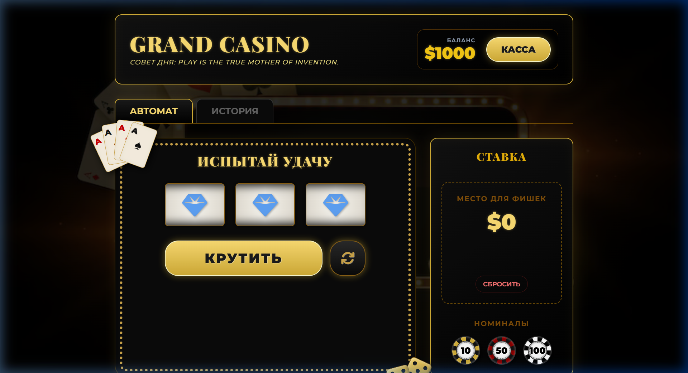
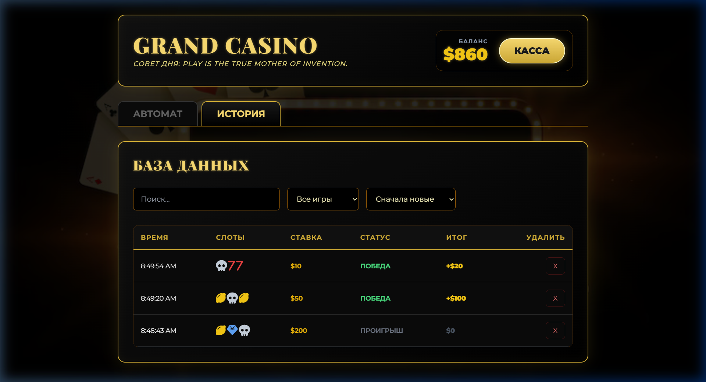
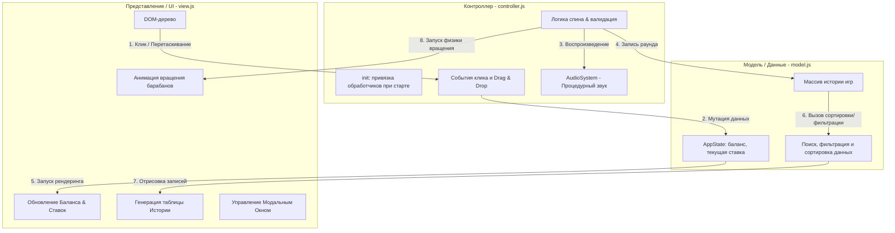

# 🎰 GRAND CASINO

<div align="center">
  
  
  
  
  

  **Современное, полностью автономное клиентское веб-приложение в премиальном стиле тёмного неонеобрутализма с процедурно-генерируемым звуком и продвинутой интерактивностью.**
  
</div>

---

## 🖼️ Скриншоты интерфейса

| 🎰 Главный экран (Игровой автомат) | 📊 База данных (История игр) |
| :---: | :---: |
|  |  |

---

## 📋 Описание проекта

**GRAND CASINO** — это интерактивный симулятор игрового автомата, разработанный с использованием чистого JavaScript (**Vanilla JS**) на архитектуре **MVC (Model-View-Controller)** без применения тяжелых клиентских фреймворков. 

Интерфейс оформлен в стиле **Dark Luxury Neobrutalism** — сочетание глубокого черного фона, золотых градиентных рамок с мягким неоновым свечением, реалистичных трехмерных фишек казино и стильной типографики.

### 🚀 Ключевые возможности:
* **🎰 Интерактивный Слот-Автомат:** Плавное вращение барабанов с физической CSS-анимацией замедления и мгновенным расчетом выигрышных комбинаций (Джекпот / Малый выигрыш / Проигрыш).
* **🔊 Процедурный Звук (Web Audio API):** Все звуковые эффекты генерируются кодом «на лету» с помощью звуковых волн разной частоты. Проект не скачивает и не хранит ни одного `.mp3` или `.wav` файла!
* **🎯 Механика ставок Drag & Drop:** Интуитивно понятное перетаскивание реалистичных фишек номиналом **$10, $50 и $100** прямо в зону ставок.
* **💼 Полнофункциональная Касса:** Пополнение игрового баланса через всплывающее модальное окно с многоступенчатой валидацией пользовательского ввода.
* **📁 Динамическая База Данных (История):** Умная таблица, отображающая историю каждой игры. Поддерживает мгновенный текстовый поиск, гибкую фильтрацию по статусу раунда (Победы/Проигрыши), многоуровневую сортировку и выборочное удаление записей.
* **🌐 Интеграция с внешним API:** При каждой загрузке приложение обращается к `api.adviceslip.com` и загружает вдохновляющий «Совет дня», стилизуя его под бегущую строку.
* **🎉 Mega Win Effects:** Реализация трехэтапного взрыва золотого конфетти с помощью библиотеки `canvas-confetti` при выпадении джекпота.

---

## 🏗️ Архитектура проекта и Data Flow

Приложение спроектировано строго в соответствии с паттерном **MVC**, разделяющим данные, логику интерфейса и пользовательские обработчики.



### 📂 Обзор модулей:
1. [main.js](file:///c:/Users/Kozak/Desktop/labs/js/indw/js/main.js) — **Точка входа.** Ждет полной загрузки DOM-дерева (`DOMContentLoaded`) и запускает инициализацию контроллера.
2. [model.js](file:///c:/Users/Kozak/Desktop/labs/js/indw/js/model.js) — **Бизнес-логика.** Объект `AppState`, инкапсулирующий текущий баланс, размер ставки, конфигурацию символов и логику фильтрации/сортировки массива истории.
3. [view.js](file:///c:/Users/Kozak/Desktop/labs/js/indw/js/view.js) — **Интерфейс.** Отвечает за рендеринг: добавление фишек на игровой стол, управление анимациями слотов через CSS Keyframes и отображение уведомлений.
4. [controller.js](file:///c:/Users/Kozak/Desktop/labs/js/indw/js/controller.js) — **Связующее звено.** Навешивает слушатели событий, выполняет математический расчет комбинаций, управляет авто-спинами и координирует работу модели и интерфейса.
5. [audio.js](file:///c:/Users/Kozak/Desktop/labs/js/indw/js/audio.js) — **Процедурная аудио-система.** Синтезирует звуки напрямую в звуковую карту.

---

## 🔊 Глубокий разбор: Процедурный звук (Web Audio API)

Вместо традиционной загрузки тяжелых звуковых файлов, проект использует **нативный низкоуровневый Web Audio API** для синтеза звуков в реальном времени. В файле [audio.js](file:///c:/Users/Kozak/Desktop/labs/js/indw/js/audio.js) реализована виртуальная система аналогового синтезатора:

* **Инструмент playTone:** Создает аудиоузел генератора (`OscillatorNode`) и узел громкости (`GainNode`), подключая их к звуковой карте (`AudioContext.destination`).
* **Имитация звука фишек (`playChip`):** Синтезируется за счет сложения двух сверхкоротких импульсов: треугольной волны (`triangle`) с частотой 2000 Гц и прямоугольной волны (`square`) с частотой 1500 Гц, воспроизводимых с задержкой в 30 мс для создания реалистичного металлического щелчка.
* **Звук вращения слота (`playClick`):** Короткие щелчки частотой 800 Гц на прямоугольной волне воспроизводятся циклически по интервалу, создавая эффект трещотки.
* **Мелодия победы (`playWin`):** Последовательный перебор мажорного арпеджио (ноты C-E-G-C: `523.25 Гц`, `659.25 Гц`, `783.99 Гц`, `1046.50 Гц`) на мягкой синусоидальной волне с наложением 10 случайных высокочастотных «искр» треугольной формы.
* **Нисходящий спад при проигрыше (`playLose`):** Использование функции `exponentialRampToValueAtTime` для плавного снижения частоты пилообразной волны (`sawtooth`) с 300 Гц до 200 Гц, имитирующего разочарование.

```javascript
// Пример генерации тона с плавным изменением частоты и затуханием громкости:
playTone(freq, type, duration, vol = 0.1, slideFreq = null) {
    if (!this.ctx) return;
    const osc = this.ctx.createOscillator();
    const gain = this.ctx.createGain();
    
    osc.type = type;
    osc.frequency.setValueAtTime(freq, this.ctx.currentTime);
    if (slideFreq) {
        osc.frequency.exponentialRampToValueAtTime(slideFreq, this.ctx.currentTime + duration);
    }
    
    gain.gain.setValueAtTime(vol, this.ctx.currentTime);
    gain.gain.exponentialRampToValueAtTime(0.01, this.ctx.currentTime + duration);

    osc.connect(gain);
    gain.connect(this.ctx.destination);
    osc.start();
    osc.stop(this.ctx.currentTime + duration);
}
```

---

## 🛠️ Инструкции по установке и локальному запуску

Поскольку проект использует нативные ES6 модули (`import/export`), браузер заблокирует их выполнение при простом двойном клике по `index.html` (политика CORS). Приложение необходимо запускать через локальный веб-сервер.

> [!IMPORTANT]
> Для корректной работы модулей и шрифтов наличие локального HTTP-сервера обязательно!

### Способы запуска:

1. **Через Python (самый быстрый):**
   Откройте терминал/консоль в корневой папке проекта и выполните команду:
   ```bash
   python -m http.server 8000
   ```
   После чего перейдите по адресу: [http://localhost:8000](http://localhost:8000).

2. **Через VS Code (Live Server):**
   * Установите расширение **Live Server**.
   * Нажмите кнопку **Go Live** в правом нижнем углу окна редактора.

3. **Через Node.js (npx):**
   Выполните в консоли:
   ```bash
   npx serve .
   ```

---

## 💻 Ключевые фрагменты кода

### Интерактивный Drag & Drop для фишек:
Пользователь зажимает фишку, перетаскивает её в специальную зону. При «дропе» значение фишки считывается из `data-value` и прибавляется к текущей ставке.

```javascript
// controller.js: Настройка зон сброса
bindDragDrop() {
    const chips = document.querySelectorAll('.chip');
    const dropZone = document.getElementById('dropZone');

    chips.forEach(chip => {
        chip.addEventListener('dragstart', (e) => {
            e.dataTransfer.setData('val', chip.dataset.value);
        });
    });

    dropZone.addEventListener('dragover', e => e.preventDefault());

    dropZone.addEventListener('drop', e => {
        e.preventDefault();
        const val = parseInt(e.dataTransfer.getData('val'));
        if (val) {
            if (AppState.currentBet + val > AppState.balance) {
                UI.showMessage('НЕДОСТАТОЧНО СРЕДСТВ ДЛЯ УВЕЛИЧЕНИЯ СТАВКИ!', 'error');
                return;
            }
            AppState.currentBet += val;
            UI.updateCounters();
            UI.addChipToTable(val);
            AudioSystem.playChip();
        }
    });
}
```

---

## 📚 Библиотеки, технологии и ресурсы

1. **Vanilla JS (ES6+)** — основная программная логика, модули, нативный веб-аудиосинтез.
2. **Tailwind CSS (via CDN)** — современная премиальная верстка, адаптивные сетки, анимации и стили неонеобрутализма.
3. **Font Awesome v6** — векторные иконки для элементов слота, кнопок автоспина и корзины удаления.
4. **Google Fonts (Montserrat & Playfair Display)** — элегантная контрастная типографика (строгий Montserrat для элементов интерфейса и благородный антиквенный Playfair Display для роскошных золотых заголовков).
5. **canvas-confetti** — библиотека создания интерактивных каскадов конфетти при крупном выигрыше.
6. **Advice Slip API** — сторонний публичный REST-сервис для получения случайных жизненных советов.

---

## 👥 Автор проекта

* **Domnici Constantin IA2503** — Дизайн интерфейса, проектирование MVC структуры, разработка игровой и звуковой логики.
