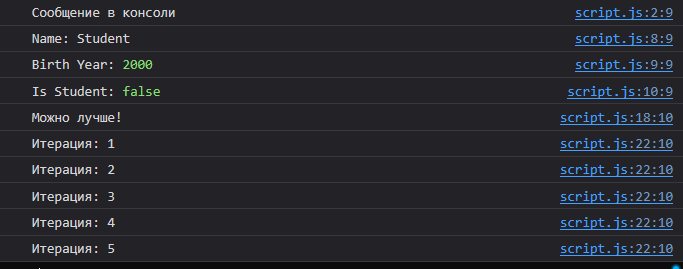

# Отчет по лабораторной работе №1

## Задание 1. Выполнение кода в браузере

### 1. Подготовка среды
- Установлен текстовый редактор VS Code.
- Установлен Node.js.
- Протестирована работа DevTools (F12) в браузере Google Chrome.

### 2. Выполнение кода JavaScript в консоли
В консоли браузера были выполнены следующие команды:
```javascript
console.log("Hello, world!");
// Результат: Hello, world!

2 + 3
// Результат: 5
```


### 3. Создание первой HTML-страницы
Был создан файл `index.html` со встроенным скриптом. При открытии страницы браузер отобразил модальное окно с текстом "Привет, мир!" и вывел сообщение в консоль.

**Код index.html:**
```html
<!DOCTYPE html>
<html lang="en">
 <head>
   <title>Привет, мир!</title>
 </head>
 <body>
   <script>
     alert("Привет, мир!");
     console.log("Hello, console!");
   </script>
 </body>
</html>
```

### 4. Подключение внешнего JavaScript-файла
Скрипт был вынесен в отдельный файл `script.js`, а в `index.html` добавлено его подключение.

**Подключение в index.html:**
```html
<script src="script.js"></script>
```

**Содержимое script.js:**
```javascript
alert("Этот код выполнен из внешнего файла!");
console.log("Сообщение в консоли");
```

---

## Задание 2. Работа с типами данных

### 1. Объявление переменных
В файле `script.js` были объявлены переменные различных типов:
```javascript
let name = "Student"; 
let birthYear = 2000;
let isStudent = false;

console.log("Name:", name);
console.log("Birth Year:", birthYear);
console.log("Is Student:", isStudent);
```

### 2. Управление потоком выполнения
Добавлен интерактивный ввод данных через `prompt` и логика условий вместе с циклом `for`.

**Код условий и цикла:**
```javascript
let score = prompt("Введите ваш балл:");
if (score >= 90) {
 console.log("Отлично!");
} else if (score >= 70) {
 console.log("Хорошо");
} else {
 console.log("Можно лучше!");
}

for (let i = 1; i <= 5; i++) {
 console.log(`Итерация: ${i}`);
}
```

---

## Контрольные вопросы

## 1. Чем отличается var от let и const?
- **var**: Имеет функциональную область видимости (или глобальную). Переменные, объявленные через `var`, можно переобъявлять.
- **let**: Имеет блочную область видимости. Нельзя переобъявить в той же области видимости.

```js
if (true) {
  var varVar = "я виден везде";
  let letVar = "я виден только тут";
}
console.log(varVar); // Работает
console.log(letVar); // Ошибка: letVar is not defined
```

- **const**: Значение переменной не может быть переприсвоено после инициализации и обязательна инициализация при объявлении.

## 2. Что такое неявное преобразование типов в JavaScript?
Это автоматическое приведение значений одного типа к другому, когда они используются вместе в выражениях. Например, при сложении числа и строки JavaScript преобразует число в строку: `5 + "5" = "55"`.

## 3. Как работает оператор == в сравнении с ===?
- **== (Нестрогое равенство)**: Перед сравнением приводит операнды к одному типу (выполняет приведение типов). Например, `5 == "5"` вернет `true`.
- **=== (Строгое равенство)**: Сравнивает и значения, и типы данных без приведения. `5 === "5"` вернет `false`.
